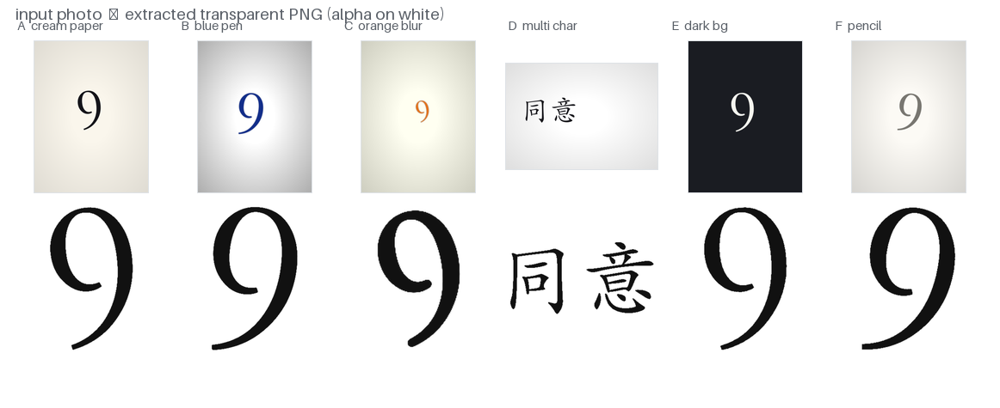
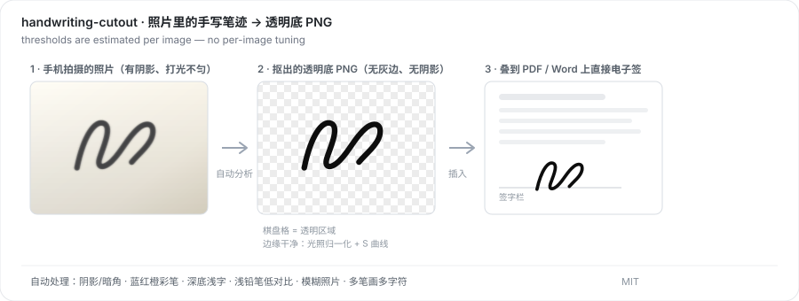

# handwriting-cutout · 手写签名抠图

[](LICENSE)
[](requirements.txt)
[](requirements.txt)

把手写签名 / 数字 / 字迹从**手机拍的照片**里抠出来，输出**透明底 PNG**，直接盖到 PDF、Word 上做电子签。

**阈值按每张图自动估计**——不同笔色、不同纸张、不同光照、不同清晰度都能直接跑，不用为换一张图去改参数。

**真实输出**（6 种拍摄条件，全程未做任何手工调参；样例如图由 `scripts/gen_cases.py` 合成生成）：



工作流程示意：



> Handwriting / signature cutout from photos → transparent PNG. Fully automatic thresholding, no per-image tuning. Designed as a [WorkBuddy / Claude-style agent skill](#作为-agent-skill-安装) and also usable as a plain CLI tool.

---

## 它解决什么

照片不能直接阈值抠图：**阴影和打光不均会被当成墨迹**，抠出来一圈灰雾，盖上文件像糊了一片。

本工具先做**光照归一化**（除以自身的大半径模糊），再按**这张图自己的墨色动态范围**定阈值，最后用 S 曲线把笔锋收利落。所以：

| 场景 | 是否自动处理 |
|---|---|
| 米色纸 / 台灯偏黄 | ✅ |
| 强暗角、明显阴影 | ✅ |
| 蓝笔 / 红笔 / 橙色马克笔 | ✅ 自动识别彩度，改用最深单通道提取 |
| 深色底 + 浅色字（黑板） | ✅ 自动反相 |
| 浅铅笔、低对比 | ✅ |
| 糊到发虚的照片 | ✅ 按模糊度自适应加强锐化 |
| 多个字 / 多笔画（如三个字签名） | ✅ 整体保留，不会只留一笔 |

## 安装

```bash
# 1. 依赖
pip install pillow numpy scipy      # scipy 可选，只影响速度

# 2. 拿到脚本
git clone https://github.com/2012xsd/handwriting-cutout.git
```

Windows 用户若 `python` 不在 PATH，用你实际的解释器路径，例如
`C:\Users\<你>\.workbuddy\binaries\python\envs\default\Scripts\python.exe`。

## 用法

```bash
# 单张
python scripts/cutout.py 我的签名.jpg -o 输出目录 --name 签名

# 多张批量
python scripts/cutout.py 图1.jpg 图2.jpg 图3.jpg -o 输出目录
```

每张图输出：

| 文件 | 用途 |
|---|---|
| `<名>_black_透明底.png` | **主推**，叠加 PDF / Word |
| `<名>_blue_透明底.png` | 蓝笔效果 |
| `<名>_red_透明底.png` | 红笔，适合盖章/批注 |
| `<名>_ink_透明底.png` | 采样自原图的**真实墨色** |
| `<名>_白底.png` | 有些工具不认透明通道时用它 |
| `<名>_预览.png` | 白纸 + 表单蓝底效果预览 |

### 常用参数（默认不用给）

| 参数 | 说明 |
|---|---|
| `--lo 0.16 --hi 0.55` | 手动绝对阈值，**覆盖自动**（只有自动失败时才用） |
| `--ink auto\|lum\|chroma` | 墨色提取方式，默认 auto |
| `--sharpen 140` | 锐化强度，默认按模糊程度自适应（糊→180，清晰→95） |
| `--scurve 2` | 边缘 S 曲线次数；`0` 更柔和，`3` 更硬 |
| `--close` | 桥接断笔（浅笔迹断线时用） |
| `--min-comp 0.02` | 保留连通域的最小面积比 |
| `--pad 10` | 裁切留边（像素） |
| `--height 1600` | 输出高度 |
| `--colors black,blue,red,ink,white` | 选择输出哪些颜色版本 |
| `--no-preview` | 不输出预览图 |
| `--debug` | 额外输出**诊断图**：直方图 + 阈值落点 + 结果缩略图 |

抠坏了就加 `--debug`，看一眼直方图上 `lo` / `hi` 落在哪，再决定加哪个参数。

## 原理

```
照片 ──► 光照归一化 ──► 按本图动态范围归一化 ──► 相对阈值 + 锐化 + S 曲线 ──► 连通域净化 ──► 裁边 ──► 透明 PNG
         raw = 1 - I/Ī      (p50 → 0, p99.5 → 1)      LO_REL=0.18 HI_REL=0.62
```

1. **光照归一化**：`raw = 1 - gray / blur(gray, 半径=长边/12)`。除以自身的大半径模糊，等价于把每一处的"本底亮度"除掉，阴影与不均匀打光同时消失。
2. **按本图动态范围归一化**：纸面取 `p50(raw)`、墨上限取 `p99.5(raw)`，映射到 0..1。这一步让同一套相对阈值对所有图片成立——**这就是"参数不固化"的核心**。
3. **相对色阶 + 锐化 + S 曲线**：`a·a·(3-2a)` 迭代 2 次，中间调被推向两端，笔锋收得利落、不留灰晕。少了 S 曲线，字看着像糊的。
4. **连通域净化**：只丢弃"面积 < 最大块 2%"的碎点，所以多笔画、多字符会整体保留。
5. **彩笔与反相**：墨迹区平均饱和度 > 0.25 时改用最深单通道提取；整图平均亮度 < 0.5 时自动反相。

## 自检

仓库自带 6 种场景的测试图生成器，可用于回归验证：

```bash
python scripts/gen_cases.py ./examples/generated          # 生成测试图（字体缺失时自动降级）
python scripts/cutout.py ./examples/generated/case_*.png -o ./examples/generated/out
```

覆盖：米色纸+旋转、蓝笔+强阴影、橙色+重度模糊小字、楷体多字、深色底浅字、浅铅笔低对比。
6 张批量约 3.5 秒（本机实测）。

## 作为 Agent Skill 安装

仓库根目录就是技能根目录（`SKILL.md` + `scripts/`）。把整个文件夹放进你所用 Agent 的技能目录即可：

```bash
git clone https://github.com/2012xsd/handwriting-cutout.git ~/.workbuddy/skills/handwriting-cutout
# Claude Code / 其他同类框架：放进对应 skills 目录
```

之后直接用自然语言触发即可：*"把这个签名抠出来做电子签"* / *"抠掉白底"*。

## English

`handwriting-cutout` extracts handwritten signatures, digits and scribbles from **camera photos** and outputs **transparent PNGs** ready to be stamped onto PDFs.

Unlike naive thresholding / magic-wand approaches, it first **normalizes uneven lighting and shadows** (dividing by a large-radius blur of the image itself), then estimates the threshold **from each image's own ink dynamic range**, and finally applies an S-curve to the alpha channel so strokes look like ink rather than a blurry photo.

Auto-handles: colored pens (blue / red / orange), dark backgrounds with light writing, low-contrast pencil, motion-blurred photos, and multi-stroke inputs (e.g. a three-character signature).

```bash
pip install pillow numpy scipy
python scripts/cutout.py your_signature.jpg -o out --name sig
python scripts/cutout.py *.jpg -o out          # batch
```

Run `--debug` to dump a histogram with the chosen thresholds if a result looks wrong.

## License

MIT © 2026 宁远安
